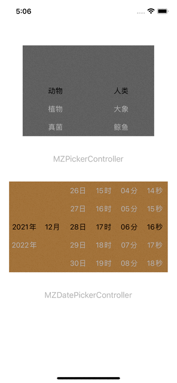

# MZDatePicker
swift扁平化日期选择组件、包含View和Controller两种形式

<div align=center>

</div>

#### Cocoapods 引入
```
pod 'MZDatePicker', '~> 0.0.1'
```

#### MZPickerView

- 参数
```
let pickerView = MZPickerView()
// 数据源
pickerView.dateSource = self
// 代理
pickerView.delegate = self
// 未选中文字颜色
pickerView.normalColor = .lightGray
// 选中文字颜色
pickerView.selectedColor = .black
// 未选中文字字体
pickerView.normalFont = .systemFont(ofSize: 16)
// 选中文字字体
pickerView.selectedFont = .systemFont(ofSize: 18)

// 选中行，只可用于获取当前选中的行
pickerView.rows
```

- 方法

```
// 刷新数据
pickerView.reloadData()

// 获取当前列选中的行，示例为第0列
let row = pickerView.selectedRow(in: 0)

// 设置默认选中行，示例为第0列选择第0行、第一列选中第2行
// animated代表是否有动画、默认未false
pickerView.selectRows([0,2], animated: true)
```

#### MZPickerController

- 参数
```
let picker = MZPickerController()
// 数据源
picker.dataSource = self
// 代理
picker.delegate = self
// 取消按钮标题
picker.cancelTitle = "取消"
// 确定按钮标题
picker.confirmTitle = "确定"
// 取消按钮标题颜色
picker.cancelColor = .lightGray
// 确认按钮标题颜色
picker.confirmColor = .brown
// 未选中文字颜色
picker.normalColor = .lightGray
// 选中文字颜色
picker.selectedColor = .black
// 未选中文字字体
picker.normalFont = .systemFont(ofSize: 16)
// 选中文字字体
picker.selectedFont = .systemFont(ofSize: 18)

self.present(picker, animated: true, completion: nil)
```

- 方法

```
// 获取当前列选中的行，示例为第0列
let row = picker.selectedRow(in: 0)

// 设置默认选中行，示例为第0列选择第0行、第一列选中第2行
// animated代表是否有动画、默认未false
picker.selectRows([0,2], animated: true)
```

#### MZDatePickerView

- 参数
```
let pickerView = MZDatePickerView()
// 代理
pickerView.delegate = self
// 类型，默认为.yyyyMMdd（年月日）
pickerView.type = .yyyyMMddHHmmss
// 起始时间
pickerView.startDate = Date(timeIntervalSinceNow: -320000)
// 结束时间
pickerView.endDate = Date(timeIntervalSinceNow: 320000)
// 选中时间
pickerView.currentDate = Date(timeIntervalSinceNow: 1000)
// 是否带有单位，例如年、月、日等，默认为true
pickerView.hasUnit = true
// 未选中文字颜色
pickerView.normalColor = .lightGray
// 选中文字颜色
pickerView.selectedColor = .black
// 未选中文字字体
pickerView.normalFont = .systemFont(ofSize: 16)
// 选中文字字体
pickerView.selectedFont = .systemFont(ofSize: 18)
```

#### MZDatePickerController

- 参数
```
let picker = MZDatePickerController()
// 代理
picker.delegate = self
// 取消按钮标题
picker.cancelTitle = "取消"
// 确定按钮标题
picker.confirmTitle = "确定"
// 取消按钮标题颜色
picker.cancelColor = .lightGray
// 确认按钮标题颜色
picker.confirmColor = .brown
// 未选中文字颜色
picker.normalColor = .lightGray
// 选中文字颜色
picker.selectedColor = .black
// 未选中文字字体
picker.normalFont = .systemFont(ofSize: 16)
// 选中文字字体
picker.selectedFont = .systemFont(ofSize: 18)
// 是否带有单位，例如年、月、日等，默认为true
pickerView.hasUnit = true
// 类型，默认为.yyyyMMdd（年月日）
picker.type = .yyyyMMddHHmm
// 起始时间
picker.startDate = Date(timeIntervalSinceNow: -1320000)
// 结束时间
picker.endDate = Date(timeIntervalSinceNow: 11320000)
// 选中时间
picker.currentDate = Date(timeIntervalSinceNow: 200000)

self.present(picker, animated: true, completion: nil)
```
